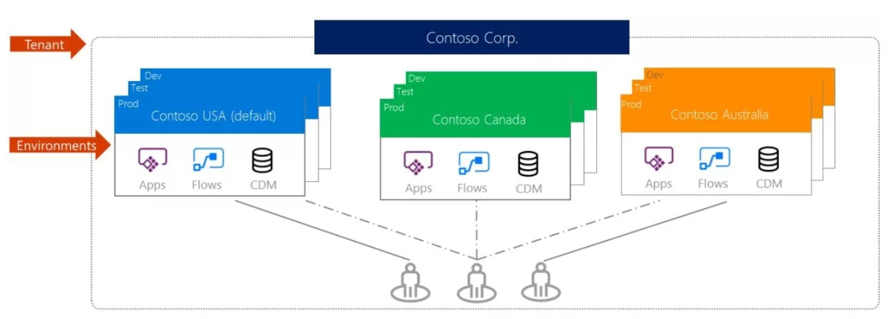
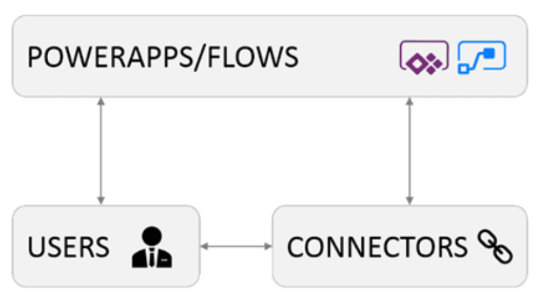
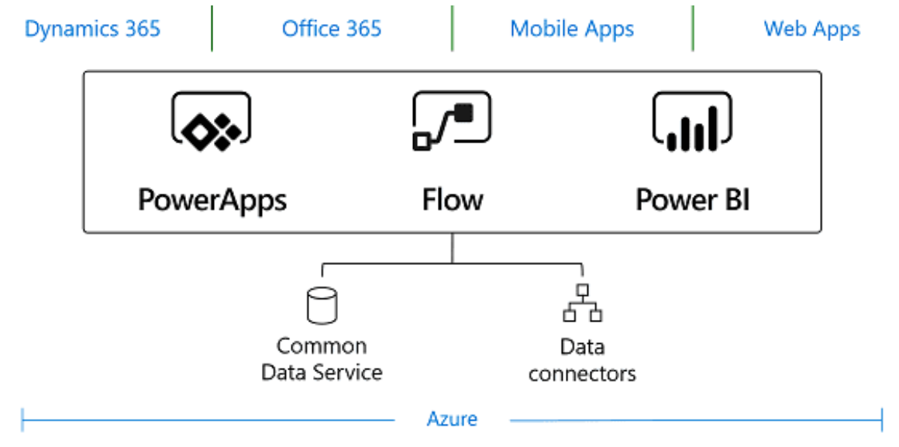

# power-app-utilities

The repo contains some PowerShell commands to manage PowerApps and Flows!

Just to keep some regularly used commands together.


## Quick refreshers

### PowerApps environments

An environment is a space to store, manage, and share organization’s business data, apps, and flows. It also serves as a container to separate apps that may have different roles, security requirements, or target audiences. Environments are isolation containers. One PowerApp, or one Flow, can belong only to one environment. Each connector must be defined per environment.

Environments are physical isolation between your apps, flows, connectors and data – if you use and create Common Data Service database, they will also be contained to the environments. 

Users, on the other hand, can be members of multiple environments.




> Any Microsoft **PowerApps Environment Admin**, **Office 365 Global Admin**, or **Azure Active Directory Tenant Admin**, who needs to have a **Plan2 license for PowerApps and/or Flow** can create and remove environments.

> Even if a user is an Office 365 Global Admin (or AAD Admin), it does not necessary mean that that user has any permissions in an actual environment

### PowerShell CmdLets

You will need the “PowerShell interface for Microsoft PowerApps and Flow” module which can be found here: https://www.powershellgallery.com/packages/Microsoft.PowerApps.PowerShell  

You will also need to install is “PowerShell interface for Microsoft PowerApps and Flow Administrative features”, which can be found here: https://www.powershellgallery.com/packages/Microsoft.PowerApps.Administration.PowerShell/

You can install them with commands below:

```powershell
Install-Module -Name Microsoft.PowerApps.PowerShell -AllowClobber 

Install-Module -Name Microsoft.PowerApps.Administration.PowerShell
```

#### Sign-in as Administrator

The following command will launch interactive login screen.

```
Add-PowerAppsAccount 
```

If you want to avoid login prompt (non-interactive) - use the following:
```
Add-PowerAppsAccount -Username <User name> -Password <Password>
```

#### Listing existing environments

```
Get-AdminPowerAppEnvironment | Format-Table -Property EnvironmentName, DisplayName, CreatedBy, Location 
```

#### Creating new Environment

First you need to know the Location IDs - therefore, run the following command:

```
// Gets the locations
Get-AdminPowerAppEnvironmentLocations 
```

Now we can create an environment:
```
// creats a trial envrionment
New-AdminPowerAppEnvironment -DisplayName 'My Environment' -Location europe -EnvironmentSku Trial 
```

#### Deleting environment

You need the environment ID to delete it. Use the above list environment command to get the ID. Then use the folllow command:

```
Remove-AdminPowerAppEnvironment -EnvironmentName <Env GUID> 
```

### Roles
There are 3 Environment roles, 

- **Administrators** (who can do everything with an environment) 
- **Makers** (people who can create and edit apps), and 
- **Users** (who don’t have to be defined on the environment level – we will grant their PowerApps usage within an app).




#### Listing Admin and Makers

```
Get-AdminPowerAppEnvironmentRoleAssignment | Where-Object {$_.EnvironmentName -eq $YourEnvironmentName} | SELECT RoleId, RoleName, RoleType,  PrincipalDisplayName, PrincipalType, PrincipalObjectId 
``` 

#### How many PowerApps your users own per Environments?

```
Get-AdminPowerApp | Select –ExpandProperty Owner | Select –ExpandProperty displayname | Group 
```


List of all apps per users:
```
$principals = Get-AdminPowerAppEnvironmentRoleAssignment | Where-Object
{$_.EnvironmentName -eq $envname} | SELECT RoleId, RoleName, RoleType, PrincipalDisplayName, PrincipalType, PrincipalObjectId

For each ($principal in $principals)
{
 
 Write-Output "{$principal.PrincipalDisplayName} Role assignments: "
 Get-AdminPowerAppRoleAssignment -UserId $principal.PrincipalObjectId | Where-Object {$_.EnvironmentName -eq $envname } | Select RoleID, PrincipalType, RoleType, AppName
}
```

#### Listing PowerApps in environments

```
Get-AdminPowerApp | Where-Object {$_.EnvironmentName -eq $YourEnvironmentId } | Format-Table -Property DisplayName, CreatedTime, EnvironmentName 
```

Display the user name who is Owner of the PowerApps:

```
// Expanding the Owner Property
Get-AdminPowerApp | Where-Object {$_.EnvironmentName -eq $YourEnvironmentId | Select AppName, CreatedTime -ExpandProperty Owner | Format-Table -Property AppName, CreatedTime, DisplayName 
``` 

#### Connectors
Connections are the gateways to underlying data – it is the place where we define which data sources PowerApps and Flows can use inside one environment.   

To get all the connections in our environment, we will use the following PowerShell Cmdlet: 

```
Get-AdminPowerAppConnection | Where-Object {$_.EnvironmentName -eq $YourEnvironmentName } 
``` 

#### Connector references (Which connectors are used in PowerApps)

Looping to apps and find connector reference:

```
$allApps=Get-AdminPowerApp | Where-Object{$_.EnvironmentName-eq$envname} | SELECT AppName,CreatedTime,EnvironmentName
foreach($app in $allApps) { 
 Write-Output "{$app.AppName} Connectors:"
    Get-AdminPowerAppConnectionReferences-EnvironmentName $envname-AppName  $app.AppName | SELECT ConnectorName,ConnectorId,DisplayName,Publisher
}
```

Find a specific connector usage:

```
$envname="<GUID>";
$connectorname = "<connector name, e.g. shared_twitter>";

$allApps = Get-AdminPowerApp | Where-Object {$_.EnvironmentName -eq $envname} | SELECT AppName, CreatedTime, EnvironmentName

foreach ($app in $allApps) {
 
 $Connectors = Get-AdminPowerAppConnectionReferences -EnvironmentName
$envname -AppName $app.AppName | Where-Object {$_.ConnectorName -eq $connectorname} | SELECT ConnectorName, ConnectorId, DisplayName, Publisher
 $ConnectorCount = ($Connectors).Count

 if ($ConnectorCount -ne 0) {
 Write-Output $app.AppName
 }
}
```

> Custom connectors are not being shown using the above CmdLets. 

#### Custom connectors

```
// For custom connectors
Get-AdminPowerAppConnector | SELECT DisplayName, CreatedTime, CreatedBy 
```


## Microsoft Flow
To get all the flows, across all the environments, we will use the simple “Get-AdminFlow” cmdlet: 

```
Get-AdminFlow 
```

List Flows per environment:
```
Get-AdminFlow | Where-Object {$_.EnvironmentName -eq $YourEnvironmentId } | Format-Table -Property DisplayName, CreatedTime, Enabled, EnvironmentName 
```

List Flows which are __Enabled__ using the below command:
```
Get-AdminFlow | Where-Object {$_.EnvironmentName -eq $YourEnvironmentId -and $_.Enabled -eq $true } | Format-Table -Property DisplayName, CreatedTime, Enabled, EnvironmentName 
```

Get the Flows by user, by expanding the CreatedBy property and use it in the Where clause.  

The following cmdlet lists all the users with Flows, grouped by user: 

```
Get-AdminFlow | Select –ExpandProperty CreatedBy | Select –ExpandProperty UserId | Group 
```


#### Enable/Disable Flow

```
Disable-AdminFlow -EnvironmentName $YourEnvironmentId -FlowName $YourFlowId
Enable-AdminFlow -EnvironmentName $YourEnvironmentId -FlowName $YourFlowId 
```


#### Remove Flow

```
Remove-AdminFlow -EnvironmentName $YourEnvironmentId -FlowName $YourFlowId 
```


#### Removing Flow Approvals

> It is **NOT** possible to make the approvals removal more granular (per Flow, per User etc).

```
// Removes all Flow Approvals in Environment
Remove-AdminFlowApprovals -EnvironmentName $YourEnvironmentId 
```

#### Get Flow User Info

We can find out what the Flow portal knows about the user, such as when the consent for the Business Apps Platform has been given etc.
```
Get-AdminFlowUserDetails –UserId $YourUserId 
``` 

Removing User Details:

```
Remove-AdminFlowUserDetails –UserId $YourUserId 
```


#### Who can edit/view Flow?

> the RoleId is a descriptive string which contains all the information we need to know: the environment name, Flow name and the principal ID

```
Get-AdminFlowOwnerRole -EnvironmentName $YourEnvironmentId -FlowName $YourFlowId 
```


#### Assign a new User with Edit permission to a Flow

```
Set-AdminFlowOwnerRole -PrincipalType User -PrincipalObjectId $YourUserId -RoleName CanEdit -FlowName $YourFlowId -EnvironmentName $YourEnvironmentId 
``` 

The argument referencve in above command:


- The PrincipalObjectId parameter has to be the user’s or group’s GUID, which you will get from your Azure Active Directory.
- The PrincipalType parameter can be either “User” or “Group”. If it is “Group”, then you will need an ID of an Azure Active Directory group in the “PrincipalObjectId” parameter.
- The RoleType parameter can be either “CanEdit” or “CanView”. You obviously can’t set another Owner here.

#### Remove a Role

```
Remove-AdminFlowOwnerRole -FlowName $YourFlowId -EnvironmentName $YourEnvironmentId -RoleId "/providers/Microsoft.ProcessSimple/environments/<ENV GUID>/flows/<FLOW ID - GUID>/permissions/<Role Assignment ID - GUID>" 
```


> The **RoleID** in above command can be retrieved via __Get-AdminFlowOwnerRole__ cmdlet.  


# CDS
Common Data Service is a data management platform in the cloud. the Common Data Services data resides on Azure SQL Servers, but it is wrapped and exposed for our use in a very user-friendly manner.



> CDS databases, in the PowerApps and Flow world, are always tied to an Environment. One environment can – but does not always have to – contain one CDS database, but **not more than one**.

There are a few important things to remember:

- You can only add a CDS database to environments, you cannot delete it
- The only exception to the previous rule is that you can delete “old”, legacy CDS databases (the new version of CDS is significantly different than the previous one)
- Once you create a CDS database in an environment, you cannot change its main properties, which are “language” and “currency.


### List CDS

The **Get-AdminPowerAppEnvironment** list the CDS along side Environments. Look into the “CommonDataServiceDatabaseProvisioningState” and “CommonDataServiceDatabaseType” properties.

```
Get-AdminPowerAppEnvironment
```

There are different database types for the CDS, however, the one which we will get here after provisioning the database is “Common Data Service for Apps”.

The Provisioning State property tells you if the database provisioning has succeeded, and what is its current state. This property is an enumeration, which can have the values listed below. Note: PowerShell will often list more user-friendly provisioning statuses (such as “Linked Database Provisioning” instead of “Creating”), but in essence, they are all wrappers around the 6 following states:

- Accepted
- Creating
- Deleting
- Failed
- Succeeded
- Updating

> Note: even if there is no CDS database in the Environment, this property will show “Succeeded”, as we can see in the screenshot above.

List Environment without CDS
```
Get-AdminPowerAppEnvironment | Where-Object {$_.CommonDataServiceDatabaseType -eq "None" } | Format-Table -Property DisplayName, CreatedTime, EnvironmentName
```

#### New CDS

> Not all currency and language combinations are available in all envrionments

```
New-AdminPowerAppCdsDatabase -EnvironmentName $YourEnvironmentId -CurrencyName HRK -LanguageName 1050 -WaitUntilFinished $false
```

There are a few parameters we need to pass to this cmdlet:

- **EnvironmentName** – this is the guid of the environment where you want to provision the database.
- **CurrencyName** – which currency will be used in all currency field formats and calculations inside the CDS database
- **LanguageName** – which language will be used for the CDS database
- **WaitUntilFinished** – should PowerShell wait until the CDS database creation is finished, and then continue, or should it continue the script while the database is still being created in the background.

You need to get the currency and Language before executing the above:

```
// List all currencies
Get-AdminPowerAppCdsDatabaseCurrencies

// List all languages
Get-AdminPowerAppCdsDatabaseLanguages
```


